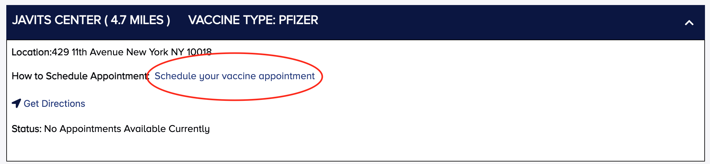
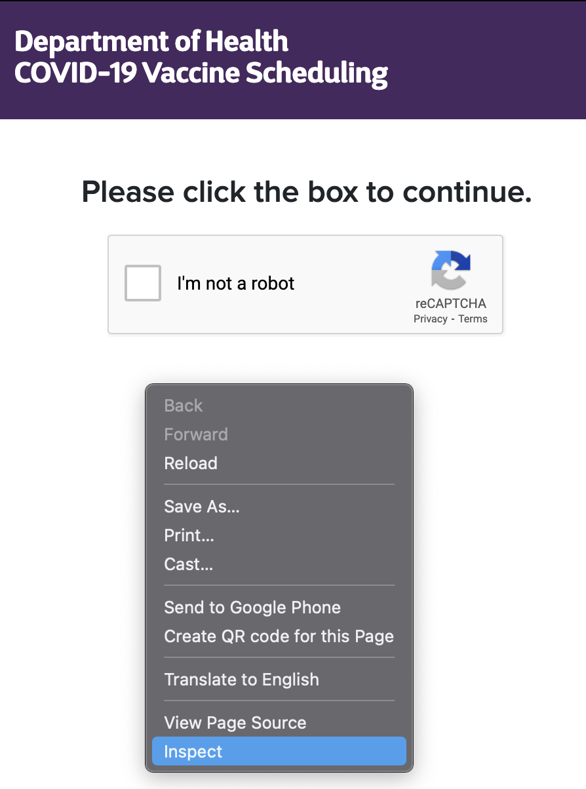
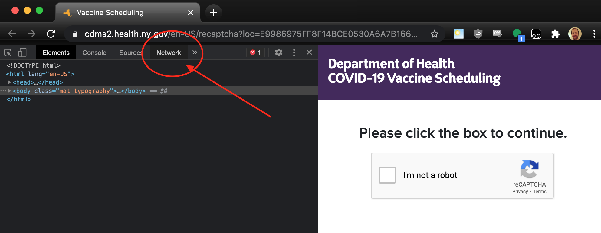
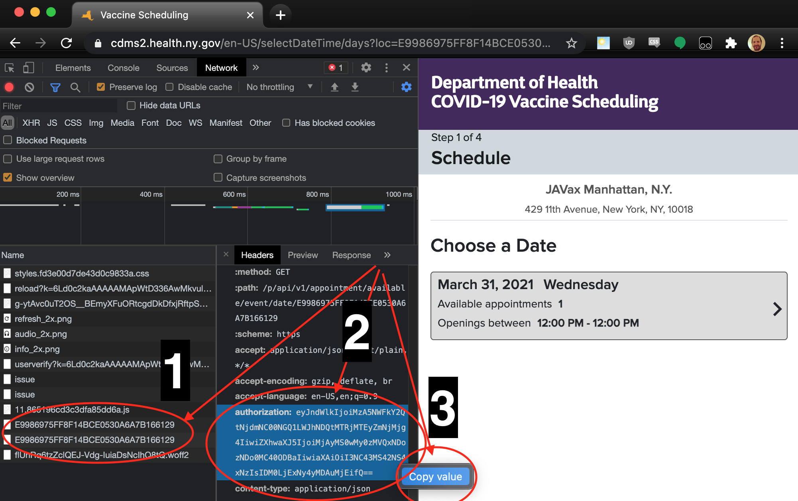

# scrapeitz
scrapeitz is a hack of a python script for scraping the Javitz Pfizer Vaccine site for appointments.

## Quickstart
These instructions assume the use of the web browser Chrome.

1. Obtain an authorization token from the Javitz Pfizer vaccine site. Start by going to https://am-i-eligible.covid19vaccine.health.ny.gov/. Fill out the form. Get to this screen and click "Schedule your vaccine appointment" to open the Javitz Pfizer page. 

1. The first page is the evil reCAPTCHA challenge. Right click and pick "inspect", or open developer tools however: 

1. Select the network tab of dev tools: 

1. Complete the reCAPTCHA challenge and copy the authorization token from the header. 
    1. Look for the highlighted string
    1. Select the authorization header
    1. Copy the value
  
1. Create a file called 'auth' and paste in the value copied above.

1. Set up a virtual environment and pip install requirements.txt:
    ```
    python3 -m venv v
    source v/bin/activate
    pip install -r requirements.txt
    ```

1. Run main.py:
    ```
    source v/bin/activate
    python main.py
    ```

1. Enjoy the show:
    ```
    (v) oldmac:scrapeitz preston4tw$ python main.py
    2021-03-31T10:48:47 start
    .2021-03-31T10:48:57 New appointments seen at 2021-03-31T10:48:57-04:00
    2021-03-31T10:48:57 B999697610E904BCE0530A6C7C166199 @ 2021-04-01T12:15:00.000-0400
    .......2021-03-31T10:49:40 New appointments seen at 2021-03-31T10:49:40-04:00
    2021-03-31T10:49:40 BD26BEC8AF3A0514E0530A6C7C1650A5 @ 2021-04-29T09:30:00.000-0400
    2021-03-31T10:49:45 New appointments seen at 2021-03-31T10:49:45-04:00
    2021-03-31T10:49:45 B999697610E904BCE0530A6C7C166199 @ 2021-04-01T10:00:00.000-0400
    ..2021-03-31T10:50:01 New appointments seen at 2021-03-31T10:50:01-04:00
    2021-03-31T10:50:01 B999697610E404BCE0530A6C7C166199 @ 2021-03-31T15:30:00.000-0400
    2021-03-31T10:50:01 B999697610E904BCE0530A6C7C166199 @ 2021-04-01T12:30:00.000-0400
    2021-03-31T10:50:01 B999697611B404BCE0530A6C7C166199 @ 2021-04-05T08:30:00.000-0400
    2021-03-31T10:50:01 B999697612F304BCE0530A6C7C166199 @ 2021-04-16T08:45:00.000-0400
    2021-03-31T10:50:01 B999697613C404BCE0530A6C7C166199 @ 2021-04-14T11:30:00.000-0400
    2021-03-31T10:50:01 BD26C1562AE00604E0530A6C7C16F42B @ 2021-04-30T11:45:00.000-0400
    2021-03-31T10:50:01 BD26E3892FAC0A92E0530A6C7C16667D @ 2021-05-06T11:45:00.000-0400
    2021-03-31T10:50:01 BD26E5C2205511CAE0530A6C7C16990F @ 2021-05-12T17:45:00.000-0400
    2021-03-31T10:50:01 BD26EC834604060EE0530A6C7C166A14 @ 2021-05-14T11:00:00.000-0400
    2021-03-31T10:50:01 BD26F1EC00E40982E0530A6C7C1694F1 @ 2021-05-18T15:30:00.000-0400
    2021-03-31T10:50:01 BD26F305C2920974E0530A6C7C16BE0F @ 2021-05-19T17:00:00.000-0400
    2021-03-31T10:50:01 BD26F305C2930974E0530A6C7C16BE0F @ 2021-05-20T16:00:00.000-0400
    2021-03-31T10:50:01 BD270257231C023CE0530A6C7C165F61 @ 2021-05-31T08:15:00.000-0400
    2021-03-31T10:50:06 New appointments seen at 2021-03-31T10:50:06-04:00
    2021-03-31T10:50:06 BD26C1562AE00604E0530A6C7C16F42B @ 2021-04-30T11:45:00.000-0400
    2021-03-31T10:50:06 BD26E3892FAC0A92E0530A6C7C16667D @ 2021-05-06T11:45:00.000-0400
    2021-03-31T10:50:06 BD26E5C2205511CAE0530A6C7C16990F @ 2021-05-12T17:45:00.000-0400
    2021-03-31T10:50:06 BD26EC834604060EE0530A6C7C166A14 @ 2021-05-14T11:00:00.000-0400
    2021-03-31T10:50:06 BD26F1EC00E40982E0530A6C7C1694F1 @ 2021-05-18T15:30:00.000-0400
    2021-03-31T10:50:06 BD26F305C2920974E0530A6C7C16BE0F @ 2021-05-19T17:00:00.000-0400
    2021-03-31T10:50:06 BD26F305C2930974E0530A6C7C16BE0F @ 2021-05-20T16:00:00.000-0400
    2021-03-31T10:50:06 BD270257231C023CE0530A6C7C165F61 @ 2021-05-31T08:15:00.000-0400
    2021-03-31T10:50:11 New appointments seen at 2021-03-31T10:50:11-04:00
    2021-03-31T10:50:11 BD26F305C2920974E0530A6C7C16BE0F @ 2021-05-19T17:00:00.000-0400
    2021-03-31T10:50:11 BD26F305C2930974E0530A6C7C16BE0F @ 2021-05-20T16:00:00.000-0400
    2021-03-31T10:50:11 BD270257231C023CE0530A6C7C165F61 @ 2021-05-31T08:15:00.000-0400
    2021-03-31T10:50:16 New appointments seen at 2021-03-31T10:50:16-04:00
    2021-03-31T10:50:16 BD270257231C023CE0530A6C7C165F61 @ 2021-05-31T08:15:00.000-0400
    ^CTraceback (most recent call last):
    File "main.py", line 146, in <module>
        main()
    File "main.py", line 118, in main
        time.sleep(5)
    KeyboardInterrupt
    ```